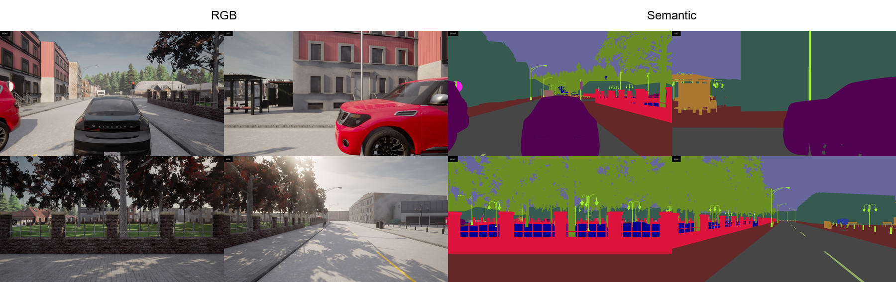
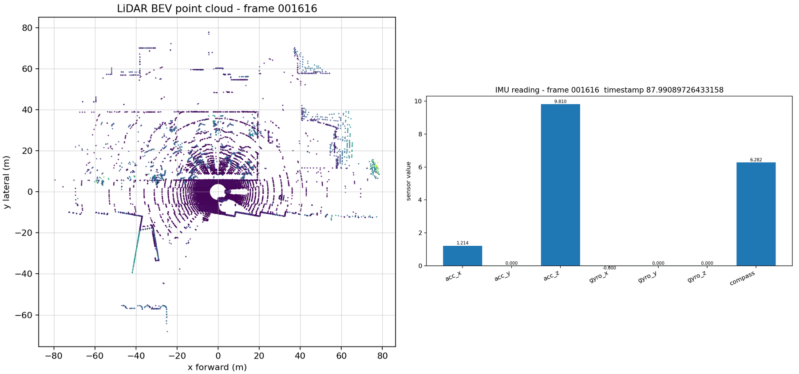
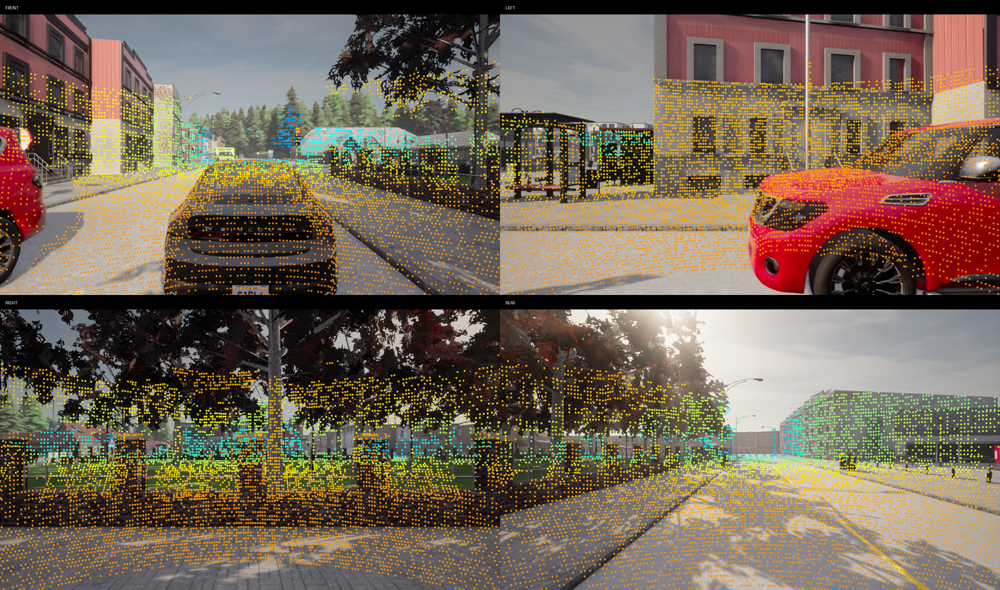
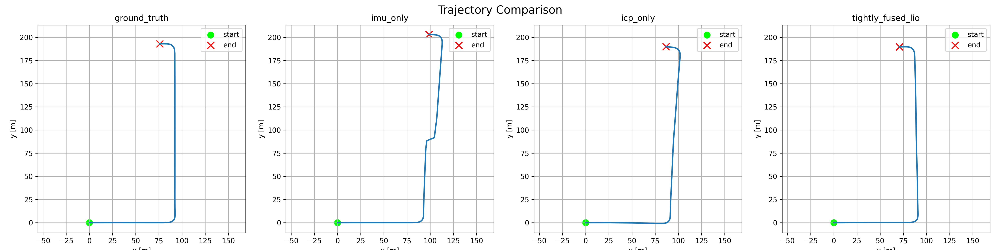
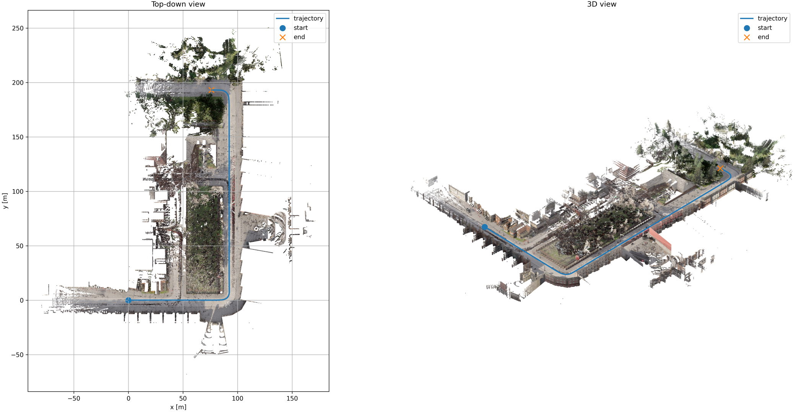
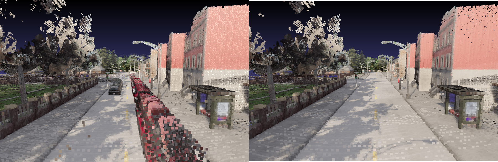
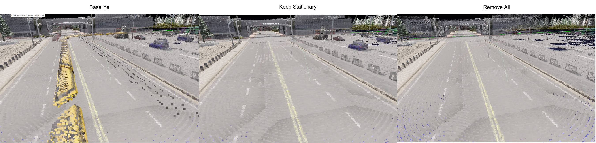
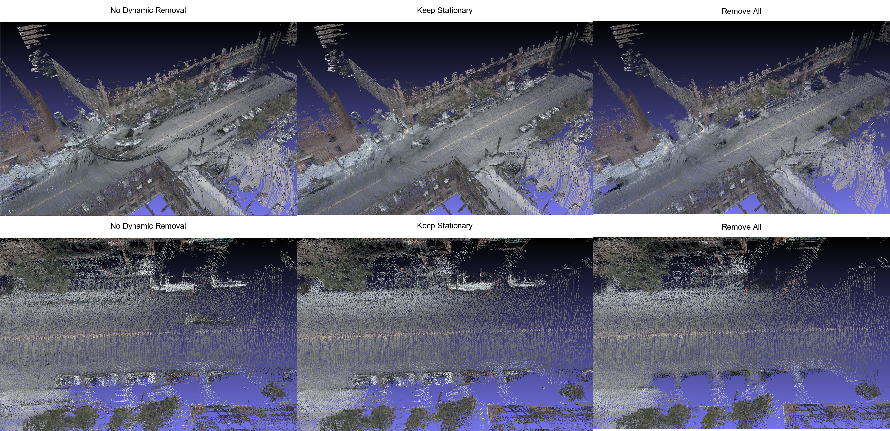
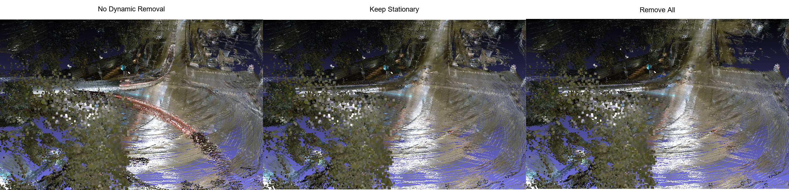
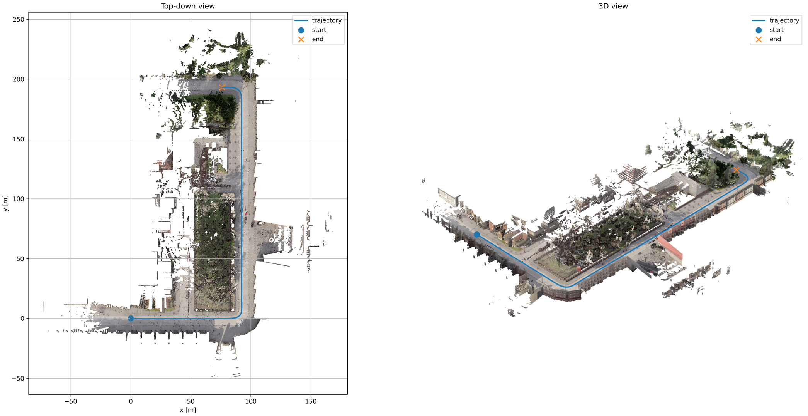

# Sensor Fusion 3D Reconstruction with Dynamic Object Removal

Robust static-world 3D reconstruction and localization from RGB, LiDAR, and IMU in CARLA, with dynamic object removal, evaluated on simulation data and real-world nuScenes scenes, spanning dense daytime traffic, multiple dynamic agents, and challenging low-visibility nighttime conditions.

Repository: https://github.com/adityapatel149/rgb-lidar-imu-3d-reconstruction


https://github.com/user-attachments/assets/c78545c6-c6b6-4cea-8eb5-502d64e122bd


### Description

- Built an end-to-end autonomous driving perception pipeline for multi-camera RGB, LiDAR, and IMU sensor fusion using **Python**, **CARLA**, **Open3D**, **OpenCV**, **PyTorch**, **YOLO-based segmentation**, and evaluated on **nuScenes** dataset.
- Implemented LiDAR-inertial odometry with point-to-plane **ICP**, **IMU propagation**, and an **Error-State Kalman Filter** for tightly fused trajectory estimation, including ATE, final drift, ICP fitness, ICP RMSE, and residual tracking.
- Developed RGB-colored **3D reconstruction** and static map building from synchronized **multi-camera RGB**, semantic segmentation, **LiDAR point clouds**, calibrated sensor intrinsics/extrinsics, voxel downsampling, statistical outlier removal, and multi-camera **projection scoring**.
- Designed **dynamic object removal** using **instance segmentation**, with multi-camera LiDAR mask projection, **parked vehicle preservation**, moving object filtering, frame-level ablation reports, map quality metrics, and reconstruction evaluation tables.


### TLDR

- Built a robust RGB, LiDAR, and IMU 3D reconstruction pipeline for autonomous driving in CARLA, including synchronized multimodal data collection, LiDAR-inertial odometry with ICP and Error-State Kalman Filtering, RGB-colored static map fusion, semantic and YOLO-based dynamic object removal, and quantitative trajectory and reconstruction evaluation.


## Project Overview

This project reconstructs a static 3D world map from dynamic autonomous driving scenes. A simulated ego vehicle in CARLA collects synchronized RGB images, semantic segmentation images, LiDAR scans, IMU measurements, ground-truth poses, and sensor calibration. The system estimates vehicle motion using LiDAR-inertial odometry with Error-State Kalman Filter, fuses LiDAR scans into a global point cloud, colorizes the map using multiple RGB cameras, removes dynamic objects using semantic or YOLO-inferred masks, and evaluates both trajectory quality and reconstruction quality.

The core idea is to treat dynamic objects as noise for static-world mapping. Vehicles, pedestrians, cyclists, and riders can create ghost trails in a fused point cloud map when their points are accumulated across time. This project addresses that problem by detecting dynamic regions in image space, projecting LiDAR points into all cameras, removing dynamic points before fusion, and optionally preserving stationary vehicles when they are repeatedly observed in stable world-frame voxels.


## End-to-End Pipeline

```text
CARLA simulator
    ↓
Synchronous data collection
    ↓
RGB images, semantic labels, LiDAR scans, IMU, poses, calibration
    ↓
IMU propagation and LiDAR ICP
    ↓
Error-State Kalman Filter LiDAR-inertial fusion
    ↓
Trajectory export and trajectory evaluation
    ↓
LiDAR point filtering and multi-camera RGB colorization
    ↓
Dynamic object removal with semantic or YOLO masks
    ↓
Static-world colored point cloud fusion
    ↓
Voxel downsampling and statistical outlier removal
    ↓
Map visualization, ablation reports, and reconstruction metrics
```


## Demo Visualizations

### CARLA Scene and Sensor Rig

The simulated data collection environment includes an ego vehicle, traffic actors, four RGB cameras, four semantic cameras, a roof-mounted LiDAR, and an IMU. Semantic data and poses are also collected to generate ground truth data.




### LiDAR-to-Camera Projection Validation



Projection validation confirms that LiDAR points, camera intrinsics, and vehicle-relative extrinsics are consistent before reconstruction.


### Trajectory Estimation



This visualization compares ground-truth, IMU-only, ICP-only, and tightly fused LiDAR-inertial trajectories.


### RGB-Colored Static Map



This visualization shows the accumulated RGB-colored point cloud reconstructed from the CARLA sensor data. The blue trajectory line represents the ego vehicle path, with markers showing the start and end positions.


### Dynamic Object Removal

Moving vehicles can create ghost trails in the reconstructed map because points from dynamic objects are accumulated over time. To reduce these artifacts, I compare the baseline reconstruction with dynamic-object filtering methods.

#### Baseline vs. Static Reconstruction



The baseline map keeps all observed objects, including moving vehicles. After dynamic-object filtering, transient vehicles are removed from the reconstruction while static scene structure such as roads, buildings, sidewalks, and vegetation is preserved.

#### Object Removal Variants





This comparison shows the effect of different filtering strategies:

- **Baseline:** No dynamic-object removal is applied.
- **Keep Stationary:** Dynamic classes are filtered, but stationary vehicles are preserved when they are likely part of the static scene (e.g. Cars in a parking lot).
- **Remove All:** All detected vehicle/object points are removed, which reduces ghosting but can also remove useful static objects such as parked vehicles.


### Map Reconstruction After Dynamic Filtering

#### Semantic-Based Filtering


The semantic-filtered map uses CARLA semantic labels to remove dynamic-object classes before accumulating the point cloud. This reduces moving-object artifacts while keeping most of the static environment intact.

#### YOLO-Based Filtering



The YOLO-filtered map removes objects detected from camera-based object detection before projecting and accumulating the point cloud. This provides a more realistic perception-based filtering setup compared with using simulator-provided semantic labels.


## Installation

### Requirements

Recommended environment:

- Linux
- Python 3.8 or later
- CARLA simulator
- Open3D
- NumPy
- SciPy
- pandas
- OpenCV
- PyYAML
- matplotlib
- PyTorch
- Ultralytics YOLO, required only for YOLO-based dynamic removal

Install Python dependencies:

```bash
pip install -r requirements.txt
```

If using YOLO dynamic removal:

```bash
pip install ultralytics
```

Start the CARLA server before data collection. The scripts assume CARLA is available on `localhost:2000`.


## How to Run

### 1. Collect a CARLA Scene

```bash
python scripts/collect_carla_data.py \
    --config configs/scene.yaml \
    --output data/carla/raw/scene_001 \
    --num_frames 600
```

This creates synchronized RGB, semantic, LiDAR, IMU, pose, and calibration outputs.


### 2. Run LiDAR-Inertial Odometry

```bash
python scripts/run_lio.py \
    --scene data/carla/raw/scene_001 \
    --voxel_size 0.25 \
    --max_corr 0.75 \
    --output outputs/trajectories/scene_001
```

This saves ground-truth, IMU-only, ICP-only, and tightly fused LIO trajectories along with ATE, final drift, and ICP statistics.


### 3. Build RGB-Colored Maps for All Pose Sources

```bash
python scripts/build_static_map.py \
    --config configs/mapping.yaml \
    --scene_dir data/carla/raw/scene_001 \
    --trajectory_dir outputs/trajectories/scene_001 \
    --output_dir outputs/maps/scene_001
```

This generates RGB-colored `.ply` maps, map trajectory plots, calibration reports, and reconstruction metrics.


### 4. Run Dynamic Object Removal Ablations

```bash
python scripts/compare_pose_maps.py \
    --mapping_config configs/mapping.yaml \
    --dynamic_config configs/dynamic_removal.yaml \
    --scene_dir data/carla/raw/scene_001 \
    --trajectory_dir outputs/trajectories/scene_001 \
    --output_dir outputs/maps/scene_001/dynamic_ablation
```

Default ablation variants:

```text
none
semantic_keep_stationary
semantic_remove_all_vehicles
yolo_keep_stationary
yolo_remove_all_vehicles
```

To run a subset:

```bash
python scripts/compare_pose_maps.py \
    --variants none semantic_keep_stationary yolo_keep_stationary
```

## Main Features

### 1. Synchronized Simulation Data Collection

The data collection pipeline uses CARLA synchronous mode so that RGB cameras, semantic segmentation cameras, LiDAR, IMU, timestamps, and poses are captured on the same simulation frame to serve as ground truth. The logger supports a configurable sensor rig and saves all data in a reproducible scene folder.

Implemented outputs:

```text
data/carla/raw/scene_001/
├── rgb/
│   ├── front/
│   ├── left/
│   ├── right/
│   └── rear/
├── semantic/
│   ├── front/
│   ├── left/
│   ├── right/
│   └── rear/
├── lidar/
├── calib/
│   ├── calibration.json
│   └── validation/
├── poses.csv
└── imu.csv
```

The default CARLA setup uses Town05, fixed simulation timestep of 0.05 seconds, 30 traffic vehicles, four RGB cameras, four semantic segmentation cameras, a 64-channel LiDAR, and an IMU.


### 2. Vehicle-Relative Sensor Calibration

The project stores all sensor calibration relative to the ego vehicle. Each sensor extrinsic follows the convention `T_vehicle_sensor`, which maps points from the sensor frame into the vehicle frame. Camera intrinsics are generated from image width, height, and field of view. The calibration builder saves:

- Camera intrinsics `K`
- Distortion vector `D`
- Camera extrinsics `T_vehicle_camera`
- LiDAR extrinsic `T_vehicle_lidar`
- IMU extrinsic `T_vehicle_imu`
- Frame convention metadata

A projection validation image is generated during data collection to verify that LiDAR points project correctly into each RGB camera.


### 3. LiDAR-Inertial Odometry and Pose Estimation

The odometry module estimates ego motion using three trajectory sources:

- IMU-only odometry from strapdown IMU integration
- ICP-only odometry from sequential LiDAR registration
- Tightly fused LiDAR-inertial odometry using an Error-State Kalman Filter

The LiDAR odometry uses Open3D point-to-plane ICP. The IMU prior initializes ICP with a motion estimate, and the ICP pose measurement updates the ESKF. The ESKF state includes position, velocity, rotation, accelerometer bias, gyroscope bias, and a 15-dimensional error state.

Saved trajectory outputs:

```text
outputs/trajectories/scene_001/
├── metrics.json
├── trajectory_comparison.png
├── ground_truth.csv
├── imu_only.csv
├── icp_only.csv
├── tightly_fused_lio.csv
├── ground_truth_poses.npz
├── imu_only_poses.npz
├── icp_only_poses.npz
└── tightly_fused_lio_poses.npz
```

Trajectory metrics saved by the project:

| Metric | Description | Output field |
| --- | --- | --- |
| IMU-only ATE | Absolute trajectory error for IMU integration | `imu_only_ate` |
| ICP-only ATE | Absolute trajectory error for LiDAR ICP odometry | `icp_only_ate` |
| Fused LIO ATE | Absolute trajectory error for ESKF-fused LIO | `tightly_fused_lio_ate` |
| IMU final drift | End-point drift for IMU-only trajectory | `imu_only_final_drift` |
| ICP final drift | End-point drift for ICP-only trajectory | `icp_only_final_drift` |
| Fused LIO final drift | End-point drift for fused LIO trajectory | `tightly_fused_lio_final_drift` |
| ICP fitness | ICP overlap quality per frame pair | `icp_stats[].fitness` |
| ICP RMSE | ICP inlier registration error | `icp_stats[].rmse` |
| ESKF residual norm | Pose update residual magnitude | `icp_stats[].residual_norm` |


### 4. RGB-Colored Point Cloud Reconstruction

The mapping module builds a global RGB-colored point cloud from LiDAR frames, camera images, calibration, and saved trajectories. Each LiDAR scan is transformed into the world frame using the selected pose source. Points are colorized by projecting them into the available RGB cameras and sampling pixel colors.

The colorization system supports multiple cameras and chooses the best camera for each LiDAR point using a projection score based on:

- Distance from image center
- Viewing angle
- Depth
- Projection validity
- Image bounds and border margin

The mapper supports ground-truth, IMU-only, ICP-only, and fused LIO poses so that reconstruction quality can be compared across pose sources.

Saved mapping outputs:

```text
outputs/maps/scene_001/
├── sync_calibration_report.json
├── baseline_colored_map.ply
├── baseline_colored_map_ground_truth.ply
├── baseline_colored_map_imu_only.ply
├── baseline_colored_map_icp_only.ply
├── map_with_trajectory_fused.png
├── map_with_trajectory_ground_truth.png
├── map_with_trajectory_imu_only.png
├── map_with_trajectory_icp_only.png
├── reconstruction_metrics.csv
└── map_outputs.json
```


### 5. Static Map Building

The map builder accumulates static LiDAR points into a global map and applies post-processing for map quality.

Implemented map processing steps:

1. Load LiDAR frame.
2. Filter invalid points and range outliers.
3. Optionally apply dynamic object filtering.
4. Colorize visible LiDAR points using RGB cameras.
5. Transform points from LiDAR frame to vehicle frame to world frame.
6. Accumulate points across the sequence.
7. Build an Open3D point cloud.
8. Apply voxel downsampling.
9. Apply statistical outlier removal.
10. Save `.ply`, visualization `.png`, frame reports, and evaluation metrics.

Key configuration options:

| Config | Purpose |
| --- | --- |
| `pose_source_for_main_output` | Selects ground truth, IMU-only, ICP-only, or fused LIO poses |
| `camera_names` | Selects RGB cameras used for colorization |
| `lidar.min_range` and `lidar.max_range` | Filters invalid near/far LiDAR points |
| `projection.center_weight` | Penalizes projections far from image center |
| `projection.angle_weight` | Penalizes oblique camera views |
| `projection.depth_weight` | Penalizes distant projections |
| `mapping.voxel_size` | Controls map resolution and memory usage |
| `mapping.remove_outliers` | Enables statistical outlier filtering |
| `mapping.outlier_nb_neighbors` | Neighbor count for Open3D outlier removal |
| `mapping.outlier_std_ratio` | Standard deviation threshold for outlier removal |


### 6. Dynamic Object Removal

Dynamic object removal is implemented as a modular filter that can be attached to the map fusion pipeline. The project supports three dynamic removal modes:

- `none`: baseline map with no dynamic object filtering
- `semantic`: CARLA semantic segmentation masks as oracle-style labels
- `yolo`: YOLO segmentation masks as a practical learned segmentation method

The semantic and YOLO modes generate image-space masks for:

- Always dynamic objects, such as pedestrians and riders
- Vehicle objects, such as cars, trucks, buses, motorcycles, and bicycles

LiDAR points are projected into all configured cameras. If any camera observes a point inside a dynamic mask, the point is marked as dynamic. This multi-camera design improves coverage for front, left, right, and rear views.


### 7. Stationary Vehicle Preservation

A key design decision is that not all vehicle points should be removed. Parked cars are static scene structure and can improve the final map. Moving vehicles, however, create ghost trails.

The project handles this with a world-frame temporal voxel consistency filter:

1. Collect vehicle candidate points from each frame.
2. Transform candidate points into the world frame.
3. Convert world coordinates into voxel keys.
4. Count repeated observations with a minimum frame gap.
5. Treat repeatedly observed vehicle voxels as stationary.
6. Keep stationary vehicle points and remove transient vehicle points.

This enables two useful dynamic-removal variants:

- Keep stationary vehicles and remove moving vehicles
- Remove all vehicle points

The default config uses `keep_stationary_vehicles: true`, `voxel_size_m: 0.10`, `min_observations_for_stationary: 20`, and `min_frame_gap: 5`.


## Evaluation

Values are reported as mean ± standard deviation across 20 randomly generated scenes recorded for 2400 frames.


### Trajectory Evaluation

Trajectory evaluation compares predicted trajectories against CARLA ground truth after aligning all trajectories to the first frame.

| Method | ATE RMSE [m] | ATE Mean [m] | ATE Median [m] | ATE Max [m] | Final Drift [m] |
| --- | ---: | ---: | ---: | ---: | ---: |
| IMU only | 105.73 ± 178.29 | 77.77 ± 131.86 | 56.16 ± 96.87 | 240.14 ± 405.49 | 240.14 ± 405.49 |
| ICP only | 10.35 ± 8.18 | 8.61 ± 6.54 | 8.76 ± 6.92 | 18.90 ± 15.17 | 16.12 ± 12.92 |
| Tightly fused LIO | 7.51 ± 5.07 | 6.58 ± 4.38 | 7.15 ± 5.44 | 12.46 ± 7.85 | 11.52 ± 7.92 |

The trajectory results show that IMU-only odometry suffers from severe accumulated drift, with much higher ATE and final drift than the geometry-based methods. ICP substantially reduces localization error by using LiDAR frame-to-frame alignment, while the tightly fused LIO pipeline performs best overall, lowering ATE RMSE from 10.35 m to 7.51 m and reducing final drift from 16.12 m to 11.52 m compared with ICP-only. The high standard deviations indicate that performance varies across scenes, likely due to differences in trajectory length, traffic density, scene geometry, and ICP alignment difficulty.


### Reconstruction Evaluation

Reconstruction evaluation compares predicted maps against the ground-truth-pose map as a reference. Metrics are computed using nearest-neighbor point cloud distances, voxel overlap, surface normal consistency, and color consistency.

| Pose Source | Chamfer L1 | Chamfer L2 | Accuracy Mean [m] | Completeness Mean [m] | Normal Consistency | Color MAE RGB | Color RMSE RGB |
| --- | ---: | ---: | ---: | ---: | ---: | ---: | ---: |
| Ground truth | 0.00 ± 0.00 | 0.00 ± 0.00 | 0.00 ± 0.00 | 0.00 ± 0.00 | 1.00 ± 0.00 | 0.00 ± 0.00 | 0.00 ± 0.00 |
| IMU only | 77.58 ± 183.25 | 49917.04 ± 131204.63 | 69.49 ± 168.06 | 8.09 ± 17.18 | 0.69 ± 0.14 | 0.16 ± 0.02 | 0.37 ± 0.04 |
| ICP only | 6.57 ± 5.56 | 76.70 ± 146.71 | 3.30 ± 3.04 | 3.27 ± 2.65 | 0.64 ± 0.08 | 0.14 ± 0.02 | 0.34 ± 0.03 |
| Tightly fused LIO | 3.44 ± 3.74 | 23.39 ± 61.12 | 1.77 ± 1.98 | 1.67 ± 1.84 | 0.67 ± 0.07 | 0.13 ± 0.02 | 0.32 ± 0.03 |

The reconstruction metrics follow the same trend as trajectory evaluation: IMU-only poses create highly distorted maps, while ICP-only significantly improves geometric consistency. Tightly fused LIO gives the best reconstruction quality overall, reducing Chamfer L1 from 6.57 to 3.44 and accuracy mean from 3.30 m to 1.77 m compared with ICP-only. Color error also improves slightly with LIO, suggesting that better pose estimates lead to cleaner RGB projection and less color misalignment in the fused point cloud.


### Precision, Recall, and F-Score

The evaluator computes point-level precision, recall, and F-score at configurable distance thresholds.

| Pose Source | Precision @ 0.10 m | Recall @ 0.10 m | F-Score @ 0.10 m | Precision @ 0.25 m | Recall @ 0.25 m | F-Score @ 0.25 m | Precision @ 0.50 m | Recall @ 0.50 m | F-Score @ 0.50 m | Precision @ 1.00 m | Recall @ 1.00 m | F-Score @ 1.00 m |
| --- | ---: | ---: | ---: | ---: | ---: | ---: | ---: | ---: | ---: | ---: | ---: | ---: |
| Ground truth | 1.00 ± 0.00 | 1.00 ± 0.00 | 1.00 ± 0.00 | 1.00 ± 0.00 | 1.00 ± 0.00 | 1.00 ± 0.00 | 1.00 ± 0.00 | 1.00 ± 0.00 | 1.00 ± 0.00 | 1.00 ± 0.00 | 1.00 ± 0.00 | 1.00 ± 0.00 |
| IMU only | 0.02 ± 0.02 | 0.02 ± 0.02 | 0.02 ± 0.02 | 0.13 ± 0.08 | 0.20 ± 0.16 | 0.16 ± 0.11 | 0.24 ± 0.11 | 0.49 ± 0.23 | 0.31 ± 0.14 | 0.36 ± 0.17 | 0.65 ± 0.22 | 0.45 ± 0.18 |
| ICP only | 0.02 ± 0.02 | 0.02 ± 0.02 | 0.02 ± 0.02 | 0.13 ± 0.07 | 0.18 ± 0.13 | 0.15 ± 0.09 | 0.26 ± 0.09 | 0.34 ± 0.16 | 0.29 ± 0.11 | 0.41 ± 0.13 | 0.48 ± 0.19 | 0.44 ± 0.14 |
| Tightly fused LIO | 0.02 ± 0.01 | 0.02 ± 0.02 | 0.02 ± 0.01 | 0.16 ± 0.06 | 0.22 ± 0.12 | 0.18 ± 0.08 | 0.33 ± 0.10 | 0.43 ± 0.16 | 0.37 ± 0.12 | 0.54 ± 0.13 | 0.62 ± 0.19 | 0.57 ± 0.16 |

Precision, recall, and F-score evaluate how closely each reconstructed map overlaps with the ground-truth-pose reference map at different distance thresholds. The strict 0.10 m threshold is difficult for all estimated-pose maps, so precision, recall, and F-score remain low even when the overall reconstruction is visually usable. As the tolerance increases to 0.50 m and 1.00 m, tightly fused LIO clearly outperforms IMU-only and ICP-only, reaching the highest F-scores. Overall, the pipeline shows consistent relative improvement over both baselines, but small-threshold overlap remains challenging. The gap between low-threshold scores and the reconstruction metrics suggests that most errors come from small pose misalignments and accumulated map drift rather than complete reconstruction failure. Future work can improve fine alignment through loop closure and pose graph optimization.


### Dynamic Object Removal Evaluation

The dynamic ablation script compares no filtering, semantic filtering, and YOLO filtering. It saves frame-level removal summaries, map densities, distance-to-baseline metrics, and frame-to-frame alignment quality.

| Variant | Total Input Points [M] | Total Kept Points [M] | Total Removed Points [M] | Removed Ratio | Always Dynamic Points [M] | Vehicle Candidate Points [M] | Stationary Vehicle Points Kept [M] | Moving Vehicle Points Removed [M] |
| --- | ---: | ---: | ---: | ---: | ---: | ---: | ---: | ---: |
| none | 60.73 ± 2.37 | 60.73 ± 2.37 | 0.00 ± 0.00 | 0.00 ± 0.00 | 0.00 ± 0.00 | 0.00 ± 0.00 | 0.00 ± 0.00 | 0.00 ± 0.00 |
| semantic_keep_stationary | 59.40 ± 6.67 | 57.17 ± 6.21 | 2.23 ± 1.44 | 0.04 ± 0.02 | 0.39 ± 0.31 | 2.34 ± 1.68 | 0.46 ± 0.46 | 1.88 ± 1.33 |
| semantic_remove_all_vehicles | 59.40 ± 6.67 | 56.71 ± 6.23 | 2.69 ± 1.79 | 0.04 ± 0.03 | 0.39 ± 0.31 | 2.34 ± 1.68 | 0.00 ± 0.00 | 2.34 ± 1.68 |
| yolo_keep_stationary | 59.40 ± 6.67 | 57.57 ± 6.28 | 1.83 ± 1.29 | 0.03 ± 0.02 | 0.09 ± 0.13 | 2.21 ± 1.64 | 0.45 ± 0.45 | 1.76 ± 1.29 |
| yolo_remove_all_vehicles | 59.40 ± 6.67 | 57.12 ± 6.29 | 2.28 ± 1.65 | 0.04 ± 0.03 | 0.09 ± 0.13 | 2.21 ± 1.64 | 0.00 ± 0.00 | 2.21 ± 1.64 |

> Point counts are reported in millions of LiDAR points and averaged across evaluated CARLA scenes.


The dynamic removal results show that all filtering variants remove a meaningful number of non-static points while preserving most of the LiDAR map. Semantic filtering removes slightly more points than YOLO because CARLA semantic labels provide cleaner oracle-style masks, while YOLO is a more practical but imperfect learned segmentation baseline. Keeping stationary vehicles preserves roughly 450k-460k vehicle points on average, which helps avoid removing parked cars that behave like part of the static scene. Overall, the ablation shows that the pipeline can separate transient dynamic objects from stable structure, with semantic filtering providing the strongest removal and YOLO demonstrating a realistic deployment-oriented alternative.

### Dynamic Ablation Map Quality

| Variant | Map Points [M] | Bounding Box Volume [M m³] | Density [points/m³] | Distance to No Filter Mean [m] | Distance to No Filter RMSE [m] | Notes |
| --- | ---: | ---: | ---: | ---: | ---: | --- |
| none | 9.33 ± 3.34 | 2.46 ± 2.68 | 5.01 ± 1.68 | 0.00 ± 0.00 | 0.00 ± 0.00 | Baseline with dynamic trails |
| semantic_keep_stationary | 8.63 ± 3.50 | 2.40 ± 2.63 | 4.66 ± 1.60 | 0.00 ± 0.01 | 0.01 ± 0.01 | Oracle-style dynamic filtering with parked vehicle preservation |
| semantic_remove_all_vehicles | 8.63 ± 3.50 | 2.40 ± 2.63 | 4.65 ± 1.60 | 0.00 ± 0.01 | 0.01 ± 0.01 | Removes all vehicle points |
| yolo_keep_stationary | 8.72 ± 3.51 | 2.40 ± 2.63 | 4.70 ± 1.63 | 0.00 ± 0.01 | 0.01 ± 0.01 | Practical segmentation-based filtering |
| yolo_remove_all_vehicles | 8.71 ± 3.51 | 2.40 ± 2.63 | 4.70 ± 1.63 | 0.00 ± 0.01 | 0.01 ± 0.01 | Aggressive learned filtering |

The dynamic ablation results show that filtering reduces the final map size from about 9.33M points to roughly 8.63M-8.72M points while preserving the overall spatial coverage of the scene. Semantic filtering removes slightly more map content than YOLO-based filtering, which is expected because CARLA semantic labels provide cleaner oracle-style dynamic masks. The very small distance-to-baseline values indicate that filtering mainly removes sparse dynamic artifacts and trails rather than changing the large-scale static structure of the reconstructed environment.

### Frame-to-Frame Alignment Quality

Alignment evaluation transforms nearby LiDAR frames into the world frame using the selected trajectory and runs a lightweight ICP correction. Good poses should require only a small correction.

| Metric | Description | Value |
| --- | ---: | ---: |
| Mean fitness | Average ICP fitness between transformed frame pairs | 0.95 ± 0.02 |
| Mean inlier RMSE | Average alignment error between frame pairs | 0.23 ± 0.03 |
| Mean correction translation norm | Average correction needed after pose transform | 0.23 ± 0.12 |

The frame-to-frame alignment metrics indicate that the fused poses produce locally consistent LiDAR alignment across nearby frames. A mean ICP fitness of 0.95 shows that most transformed frame pairs have strong geometric overlap, while the 0.23 m inlier RMSE suggests relatively low local registration error. The correction translation norm of 0.23 m means that after applying the estimated poses, ICP only needs a small additional adjustment, supporting that the trajectory is stable enough for static map fusion.


## Design Decisions

### Python-first implementation

The project is implemented in Python for fast iteration across simulation, geometry processing, machine learning segmentation, evaluation, visualization, and experiment management. This is appropriate for a research-focused computer vision project where correctness, reproducibility, and clear modular design are more important than low-level deployment performance.


### CARLA synchronous mode

Synchronous mode ensures that every sensor measurement corresponds to the same simulation frame. This reduces timestamp ambiguity and makes downstream fusion, projection, and evaluation more reliable.


### Vehicle-relative calibration

All sensor extrinsics are stored relative to the ego vehicle instead of world coordinates. This makes the calibration reusable across frames and allows consistent transformations between LiDAR, camera, IMU, vehicle, and world coordinate systems.


### Multi-camera RGB colorization

A single front camera cannot colorize all LiDAR points in a 360-degree driving scene. The project uses front, left, right, and rear cameras and selects the best camera per point using projection quality. This improves colored reconstruction coverage and reduces poor color assignments from oblique views.


### LiDAR-first reconstruction

LiDAR provides direct metric 3D structure, which is reliable for static map building. RGB is used for appearance, semantic filtering, and visualization. This makes the system more stable than relying only on monocular geometry.


### ESKF for LiDAR-inertial fusion

The Error-State Kalman Filter separates nominal state propagation from small error-state corrections. IMU propagation provides high-frequency motion prediction, while ICP provides geometric pose measurements to reduce drift.


### Dynamic removal before map fusion

Dynamic objects are filtered before point cloud fusion, not after. Removing dynamic points before accumulation prevents moving actors from being integrated into the global map as repeated ghost trails.


### Stationary vehicle preservation

Parked vehicles are part of the static scene. Removing every vehicle can over-filter useful structure. The temporal voxel consistency filter keeps vehicle points that remain stable in world space while removing transient vehicle points.


### Ground-truth map as reconstruction reference

For simulated data, the ground-truth-pose map provides a practical reference map. Predicted maps generated from IMU-only, ICP-only, and fused poses can be compared against this reference using point cloud and voxel metrics.


## Project Structure

```text
rgb-lidar-imu-3d-reconstruction/
├── README.md
├── requirements.txt
├── configs/
│   ├── scene.yaml
│   ├── mapping.yaml
│   └── dynamic_removal.yaml
├── scripts/
│   ├── collect_carla_data.py
│   ├── run_lio.py
│   ├── build_static_map.py
│   └── compare_pose_maps.py
├── src/
│   ├── calibration/
│   │   ├── calibration_builder.py
│   │   └── calibration_loader.py
│   ├── data_collection/
│   │   ├── carla_logger.py
│   │   ├── sensor_setup.py
│   │   └── sync_mode.py
│   ├── dynamic_removal/
│   │   ├── dynamic_point_filter.py
│   │   ├── lidar_masking.py
│   │   ├── semantic_masks.py
│   │   ├── vehicle_motion_filter.py
│   │   └── yolo_masks.py
│   ├── evaluation/
│   │   ├── reconstruction_eval.py
│   │   └── trajectory_eval.py
│   ├── mapping/
│   │   ├── camera_selection.py
│   │   ├── colorize_pointcloud.py
│   │   ├── fuse_pointclouds.py
│   │   ├── outlier_filter.py
│   │   └── voxel_map.py
│   ├── odometry/
│   │   ├── eskf.py
│   │   ├── icp_odometry.py
│   │   ├── imu_odometry.py
│   │   ├── lio.py
│   │   └── trajectory_utils.py
│   ├── utils/
│   │   ├── camera_geometry.py
│   │   ├── io.py
│   │   ├── projection.py
│   │   ├── projection_debug.py
│   │   ├── transforms.py
│   │   └── visualization.py
│   └── visualization/
│       ├── vis_map.py
│       └── vis_trajectory.py
├── assets/
│   └── README visualizations
├── data/
│   └── carla/
└── outputs/
    ├── trajectories/
    └── maps/
```


## Module Breakdown

#### `configs/`

Stores experiment configuration for CARLA scenes, sensor setup, mapping, projection, evaluation, and dynamic object removal.


#### `scripts/`

Top-level runnable scripts for data collection, LIO, map building, and dynamic-removal ablations.


#### `src/calibration/`

Builds and loads vehicle-relative camera, LiDAR, and IMU calibration.


#### `src/data_collection/`

Handles CARLA actor spawning, synchronous sensor capture, semantic image saving, LiDAR saving, pose logging, IMU logging, and multiprocessing disk writing.


#### `src/odometry/`

Implements IMU-only odometry, ICP-only odometry, tightly fused LiDAR-inertial odometry, ESKF propagation and updates, and trajectory utilities.


#### `src/mapping/`

Implements multi-camera RGB colorization, point cloud fusion, voxel downsampling, map density estimation, and statistical outlier removal.


#### `src/dynamic_removal/`

Implements semantic mask loading, YOLO mask prediction, LiDAR mask projection, dynamic point filtering, and stationary vehicle detection.


#### `src/evaluation/`

Computes trajectory metrics, final drift, reconstruction metrics, Chamfer distance, precision, recall, F-score, voxel IoU, color errors, normal consistency, and frame-to-frame alignment quality.


#### `src/utils/`

Contains shared coordinate transforms, camera projection utilities, image and point cloud I/O, projection debugging, and visualization helpers.


#### `src/visualization/`

Generates trajectory comparison plots and map-with-trajectory visualizations.


## Configuration Summary

### Scene Configuration

The scene config defines the CARLA world, traffic density, ego vehicle, RGB cameras, semantic cameras, LiDAR, and IMU.

Key defaults:

| Setting | Value |
| --- | --- |
| Town | Town05 |
| Fixed delta seconds | 0.05 |
| Traffic vehicles | 30 |
| RGB cameras | front, left, right, rear |
| Semantic cameras | front, left, right, rear |
| Camera resolution | 1280 x 720 |
| Camera FOV | 90 degrees |
| LiDAR channels | 64 |
| LiDAR range | 80 m |
| LiDAR points per second | 1,000,000 |
| LiDAR rotation frequency | 20 Hz |


### Mapping Configuration

The mapping config controls scene paths, pose source, camera selection, LiDAR filtering, projection scoring, voxel downsampling, outlier removal, and reconstruction evaluation thresholds.

Key defaults:

| Setting | Value |
| --- | --- |
| Main pose source | fused |
| RGB cameras | front, left, right, rear |
| LiDAR min range | 0.5 m |
| LiDAR max range | 80.0 m |
| Color mode | best camera |
| Voxel size | 0.10 m |
| Outlier removal | enabled |
| Outlier neighbors | 20 |
| Outlier std ratio | 2.0 |


### Dynamic Removal Configuration

The dynamic removal config controls semantic filtering, YOLO filtering, projection behavior, and stationary vehicle detection.

Key defaults:

| Setting | Value |
| --- | --- |
| Method | yolo |
| Semantic dynamic classes | pedestrian, rider, dynamic |
| Semantic vehicle classes | car, truck, bus, motorcycle, bicycle |
| YOLO dynamic classes | person |
| YOLO vehicle classes | bicycle, car, motorcycle, bus, truck |
| Mask dilation | 5 px |
| Keep unprojected points | true |
| Keep stationary vehicles | true |
| Stationary voxel size | 0.5 m |
| Min observations for stationary | 30 |
| Min frame gap | 5 |


## Expected Output Files

After running the full pipeline, the project produces:

```text
outputs/
├── trajectories/
│   └── scene_001/
│       ├── metrics.json
│       ├── trajectory_comparison.png
│       ├── *.csv
│       └── *_poses.npz
└── maps/
    └── scene_001/
        ├── *.ply
        ├── *.png
        ├── reconstruction_metrics.csv
        ├── sync_calibration_report.json
        ├── map_outputs.json
        └── dynamic_ablation/
            ├── dynamic_ablation_results.json
            ├── none/
            ├── semantic_keep_stationary/
            ├── semantic_remove_all_vehicles/
            ├── yolo_keep_stationary/
            └── yolo_remove_all_vehicles/
```


## Interpreting Results

### Strong trajectory result

A strong trajectory result should show lower ATE and final drift for tightly fused LIO than for IMU-only and ICP-only baselines. The trajectory plot should show the fused trajectory closely following the ground-truth path.


### Strong reconstruction result

A strong reconstruction result should show lower Chamfer distance, better completeness, higher precision and recall, higher voxel IoU, and more consistent surface normals for maps built from fused LIO poses compared with IMU-only poses.


### Strong dynamic-removal result

A strong dynamic-removal result should show fewer ghost trails around moving vehicles and pedestrians while preserving road boundaries, buildings, parked vehicles, poles, sidewalks, and other static scene geometry.


### Common failure cases

- Sparse dynamic trails can remain when dynamic masks are imperfect or LiDAR points project behind occluding structures such as fences.
- Pose drift can create duplicated edges or blurred static structures in the fused map.
- Aggressive vehicle removal can delete parked cars and reduce useful static geometry.
- Learned YOLO masks can miss far, occluded, or partially visible traffic actors.
- Projection-based filtering depends on accurate calibration and correct camera coverage.


## Future Work

- Add a sensor corruption engine for sim-to-real robustness experiments, including RGB noise, blur, illumination changes, LiDAR dropout, LiDAR range noise, IMU Gaussian noise, IMU bias drift, and cumulative drift.
- Evaluate transfer to real-world autonomous driving datasets such as KITTI and nuScenes.
- Add robustness curves for clean, mild, medium, and severe corruption levels.
- Add optional ROS2 or streaming support for real-time experimentation.


## Skills Demonstrated

- Autonomous driving perception system design
- RGB, LiDAR, and IMU sensor fusion
- 3D point cloud processing and reconstruction
- LiDAR-inertial odometry and pose estimation
- Error-State Kalman Filter implementation
- ICP registration and trajectory evaluation
- Multi-camera calibration and 3D-to-2D projection
- Semantic segmentation and instance segmentation integration
- Dynamic object removal for static-world mapping
- Synthetic data generation in CARLA
- Reproducible experiment design with YAML configs
- Quantitative evaluation and visualization
- Python software engineering for computer vision systems


## Keywords

> Computer Vision, Machine Learning, 3D Reconstruction, Autonomous Driving, Sensor Fusion, LiDAR Odometry, Visual-LiDAR Fusion, LiDAR-Inertial Odometry, LIO, Error-State Kalman Filter, ESKF, ICP, Point-to-Plane ICP, SLAM, Localization, Pose Estimation, Trajectory Estimation, Static Map Building, Dynamic Object Removal, Semantic Segmentation, Instance Segmentation, YOLO Segmentation, CARLA Simulator, Synthetic Data, Sim-to-Real, RGB-D Geometry, Multi-Camera Projection, Point Cloud Processing, Open3D, PyTorch, NumPy, SciPy, OpenCV, Evaluation Metrics, ATE, Drift, Chamfer Distance, Precision, Recall, F-Score, Voxel IoU, KITTI, nuScenes.


## Author

Aditya Patel

GitHub: https://github.com/adityapatel149
